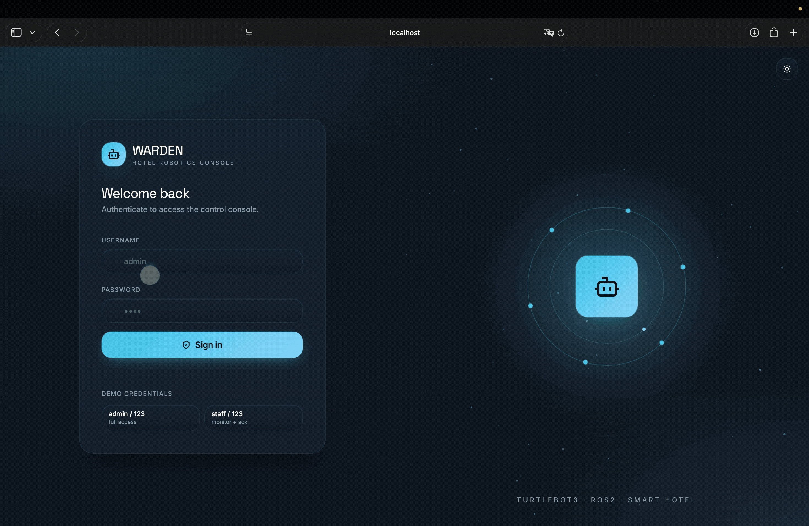
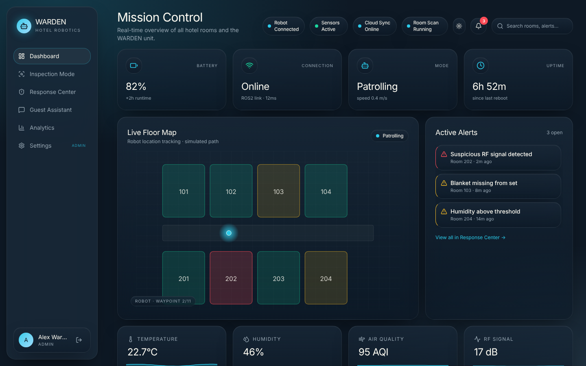
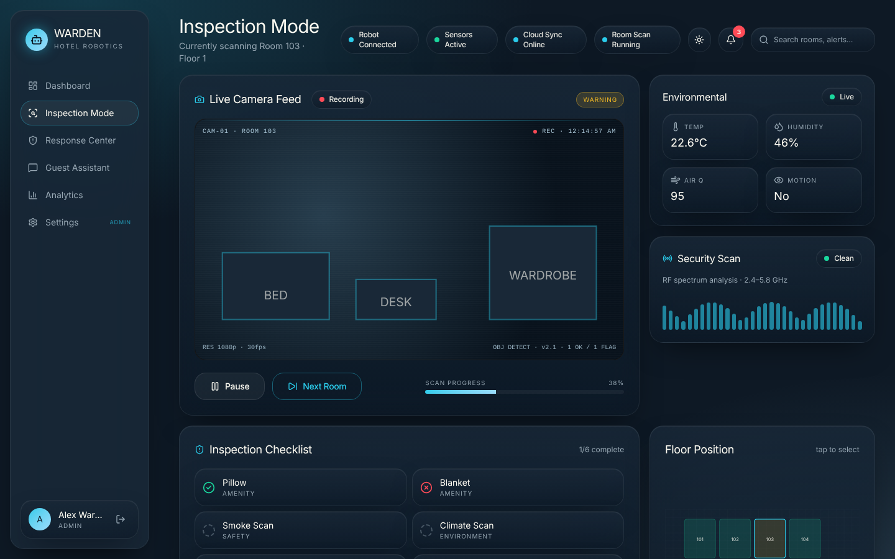
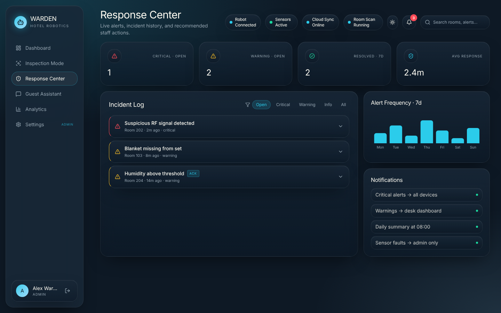
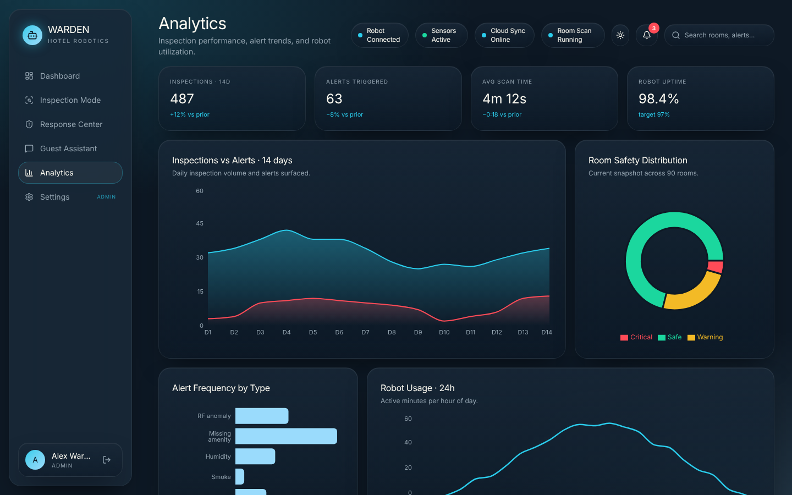
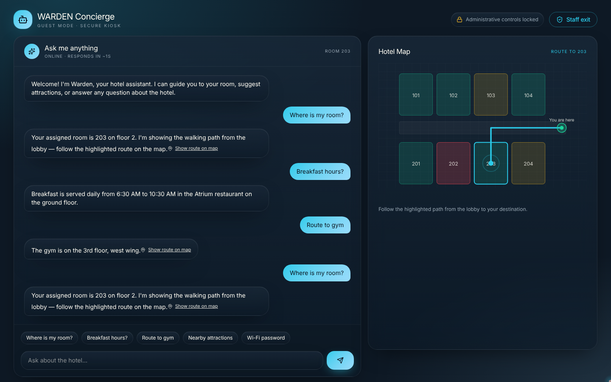
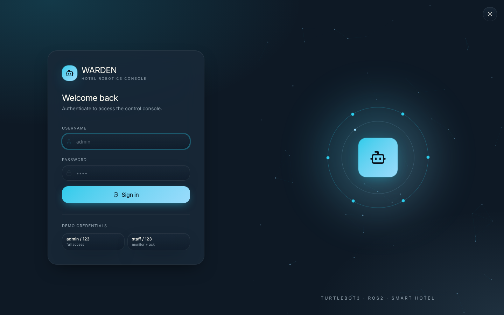
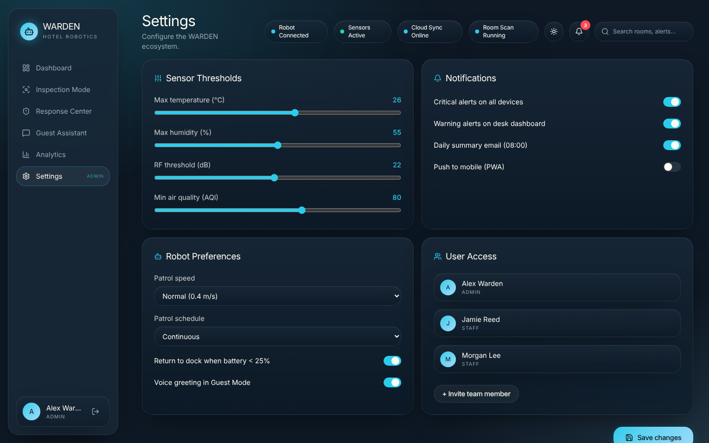

# WARDEN: Smart Hotel Robotics Console

WARDEN is a web dashboard for a hotel monitoring robot based on **TurtleBot3**. Hotel staff use it to watch the robot as it inspects rooms, check live sensor readings, respond to alerts and review analytics. A separate **Guest Assistant** kiosk mode lets hotel guests chat with a concierge bot and see the walking route to their room on a map.

> **Note:** All real-time data in this version is simulated. The app is built on a service layer, so a real ROS2 / WebSocket / REST backend can be connected later without changing the UI.



## Screenshots

### Dashboard
KPIs, system status, the live floor map with the robot's position, and active alerts.



### Inspection Mode
Live camera feed with object detection, environmental sensors, the RF security scan and the inspection checklist.



### Response Center
Incident log filterable by severity, alert frequency and notification rules.



### Analytics
Inspection and alert trends, room safety distribution and robot usage.



### Guest Assistant
The guest chats with the concierge, and the map shows the route to their room.



<details>
<summary>More screenshots (Login, Settings)</summary>




</details>

---

## Features

### Staff console (requires login)

| Page | What it does |
|------|--------------|
| **Dashboard** | KPIs (battery, connection, mode, uptime), system status chips, live room monitoring cards, an animated floor map that tracks the robot, and an active alerts feed. |
| **Inspection Mode** | Live environmental sensors (temperature, humidity, air quality, motion), a simulated hidden-camera scan on a live camera feed, a missing-items checklist, a room status (Safe / Warning / Critical) and robot controls. |
| **Response Center** | A real-time alert stream filterable by severity, an incident log with recommended staff actions, notifications, and acknowledge / resolve actions. |
| **Analytics** | Charts for inspections vs. alerts, alert frequency by type, room safety distribution and robot usage. |
| **Settings** | Sensor thresholds, notification toggles, robot preferences and user access. Editable by admins, read-only for staff. |
| **Guest Mode handoff** | Lets staff switch a device into kiosk mode for a guest. |

### Guest Assistant kiosk (`/guest`)

- A chat assistant that answers questions about room directions, breakfast hours, Wi-Fi, the gym, the pool, the airport shuttle and nearby attractions.
- A hotel map that highlights the walking route from the lobby to the guest's room or the facility they asked about.
- Kiosk lock: admin controls are hidden, back navigation is blocked, and leaving the kiosk requires a staff PIN.

### Roles and permissions

| Capability | Admin | Staff |
|------------|:-----:|:-----:|
| View all pages | ✓ | ✓ |
| Acknowledge alerts | ✓ | ✓ |
| Resolve / dispatch alerts | ✓ | ✗ |
| Robot controls | ✓ | ✗ |
| Edit settings | ✓ | ✗ |
| Enable Guest Mode | ✓ | ✓ |

### UI and design

- Glassmorphism design with dark and light themes
- Framer Motion animations: a custom cursor, magnetic buttons, an ambient particle background and pulsing live indicators
- Responsive layout with a mobile navigation bar

---

## Tech stack

- **Framework:** [TanStack Start](https://tanstack.com/start) (React 19 + TanStack Router, file-based routing)
- **Language:** TypeScript
- **Build tool:** Vite
- **Styling:** Tailwind CSS v4, shadcn/ui (Radix UI) components
- **Animation:** Framer Motion
- **Charts:** Recharts
- **State:** Zustand (live data store), React Context (auth and theme)
- **Icons:** lucide-react
- **Deployment:** Cloudflare Workers (Wrangler)
- Initially generated with [Lovable](https://lovable.dev)

---

## Getting started

### Prerequisites

- [Bun](https://bun.sh) (recommended, since the project includes `bun.lock`) or Node.js 20+ with npm

### Installation

```bash
git clone https://github.com/<your-username>/warden.git
cd warden
bun install        # or: npm install
```

### Run locally

```bash
bun run dev        # or: npm run dev
```

Then open the URL shown in the terminal (usually `http://localhost:5173` or `http://localhost:8080`).

### Demo accounts

| Role | Username | Password |
|------|----------|----------|
| Admin | `admin` | `123` |
| Staff | `staff` | `123` |

The staff PIN to exit Guest Mode is also `123`.

### Available scripts

| Command | Description |
|---------|-------------|
| `bun run dev` | Start the development server |
| `bun run build` | Build for production |
| `bun run build:dev` | Build in development mode |
| `bun run preview` | Preview the production build |
| `bun run lint` | Run ESLint |
| `bun run format` | Format code with Prettier |

---

## Project structure

```
src/
├── components/          # App components (FloorMap, GlassCard, Sidebar, Topbar, ...)
│   └── ui/              # shadcn/ui base components
├── hooks/               # Custom React hooks
├── lib/
│   ├── auth.tsx         # Mock authentication and roles (admin / staff)
│   ├── live-store.ts    # Zustand store that simulates live data
│   ├── mock-data.ts     # Rooms, alerts, sensors and FAQ demo data
│   └── theme.tsx        # Dark / light theme
├── routes/
│   ├── __root.tsx       # Root layout
│   ├── index.tsx        # Redirects to /dashboard
│   ├── login.tsx        # Sign-in page
│   ├── guest.tsx        # Guest Assistant kiosk
│   ├── _authenticated.tsx           # Protected layout (sidebar + route guard)
│   └── _authenticated/
│       ├── dashboard.tsx
│       ├── inspection.tsx
│       ├── response.tsx
│       ├── analytics.tsx
│       ├── settings.tsx
│       └── guest-mode.tsx
├── services/            # Service layer between the UI and the backend
│   ├── types.ts         # Service contracts (interfaces)
│   ├── mock.ts          # Current mock implementation
│   └── index.ts         # Active service export
├── server.ts            # Server entry (Cloudflare Worker)
└── styles.css           # Design tokens and global styles
```

---

## Connecting a real backend

The UI never talks to data sources directly. It goes through `src/services`, which defines contracts for:

- `SensorService`: current readings, live subscription and history
- `RobotService`: robot state and commands (`pause`, `resume`, `return-to-dock`, `next-room`)
- `RoomService`, `AlertService`, `InspectionService`, `GuestService`

To connect real hardware (for example, a ROS2 bridge):

1. Create a new adapter such as `src/services/ros2.ts` that implements `ServiceBundle` from `types.ts`.
2. Switch the export in `src/services/index.ts`, optionally behind an environment flag:

   ```ts
   const useReal = import.meta.env.VITE_USE_REAL_SENSORS === "true";
   export const services = useReal ? ros2Services : mockServices;
   ```

No UI changes are needed as long as the contracts are kept. See [`src/services/README.md`](src/services/README.md) for details.

---

## Deployment

The project is set up for **Cloudflare Workers** (see `wrangler.jsonc`).

```bash
bun run build
npx wrangler deploy
```

---

## Limitations and future work

- [ ] Connect to a real TurtleBot3 via ROS2 / WebSocket
- [ ] Replace mock auth with real authentication (for example, Supabase)
- [ ] Stream real camera feeds
- [ ] Connect the guest chatbot to an LLM or the hotel's property management system

---

## Author

**Datkaiym Tologonova**
[LinkedIn](https://www.linkedin.com/in/datkaiym-tologonova/)
